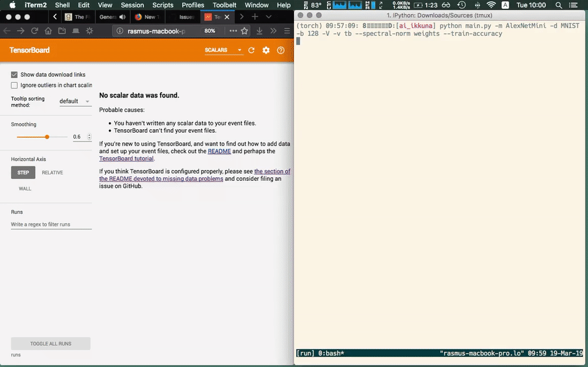

<p align="center">

</p>

A tool for monitoring neural network training. Users, testers and contributors
welcome.

---

1. [What the hell is this?](#what-the-hell-is-this)
2. [Quickstart](#quickstart)
3. [Examples](#examples)
4. [API Reference](#documentation)

---

# What the hell is this?

Ikkuna provides a framework for adding live training metrics to your PyTorch
model with minimal configuration. It is a PubSub framework which allows
researchers to quickly test metrics implemented against a simple API and users
to use such metrics to keep tabs on their models' performance.

For supervising your model, you can define a metric as a subscriber which will
then be notified through messages of incoming data required for computing the
metric. The subscriber is completely model-agnostic and can be installed as a
plugin for others to use.

The following data is provided

* Activations
* Gradients w.r.t weights and biases
* Gradients w.r.t layer outputs
* Weights
* Biases
* Weight updates
* Bias updates
* Metadata such as current step in the training, current labels and current
  predictions

Subscribers consume this data and distil it into metrics. Different backends can be
used

* Matplotlib (currently doesn't work)
* Tensorboard

# Quickstart

Run

```
pip install ikkuna
```

or run the `setup.py` script after cloning this repository.

# Examples



As an appetiser, consider the Problem of wanting to compute the norm of the
gradients of each layer at every 10th time step as your model is training. But you don't want to add
operations for each layer manually.

Let's start with a small model:

```
class FullyConnectedModel(torch.nn.Module):

    def __init__(self, input_shape, num_classes=1000):
        super(FullyConnectedModel, self).__init__()

        # if channel dim not present, add 1
        if len(input_shape) == 2:
            input_shape = list(input_shape) + [1]
        H, W, C = input_shape

        self.features = torch.nn.Sequential(
            torch.nn.Linear(H * W * C, 4000),
            torch.nn.ReLU(inplace=False),
            torch.nn.Linear(4000, 4000),
            torch.nn.ReLU(inplace=False),
            torch.nn.Linear(4000, 4000),
            torch.nn.ReLU(inplace=False)
        )
        self.classifier = torch.nn.Sequential(
            torch.nn.Linear(4000, 1000),
            torch.nn.ReLU(inplace=False),
            torch.nn.Linear(1000, num_classes),
        )

    def forward(self, x):
        B, C, H, W = x.shape
        x = x.view(B, C * H * W)
        x = self.features(x)
        x = self.classifier(x)
        return x
```

The only thing to change is to create an `ikkuna.export.Exporter` object and
inform it of the model. It then traverses the layer hierarchy and publishes all
kinds of data as the model is training.

In your training code, you can set up the Exporter and register metrics:

```
from ikkuna.export import Exporter
from ikkuna.export.subscriber import NormSubscriber

ex = Exporter(depth=-1)
model = FullyConnectedModel(...)
ex.add_modules(model)
ex.message_bus.register_subscriber(NormSubscriber('layer_gradients', subsample=10))

# train loop here
```

This will log tensorboard summaries to `run/` per default.

The `NormSubscriber` automagically computes the norm of the chosen topic, here
gradients with respect to layers. `ikkuna` provides these subscribers out of the
box:

* `TrainAccuracySubscriber`: Compute the accuracy over the current batch
* `TestAccuracySubscriber`: Compute accuracy over some test set (halts training)
* `LossSubscriber`: Compute loss over the current batch
* `VarianceSubscriber`: Compute variance over tensor
* `NormSubscriber`: Computes _p_-Norm over tensor
* `SpectralNormSubscriber`: computes the spectral norm (largest singular value)
  over tensor without explicit eigenvalue decomposition
* `RatioSubscriber`: computes ratio of L2-Norms of two quantities. Useful for
  tracking ratio between weight updates and weights
* `SVCCASubscriber`: Computes a representational self-similarity over tensors
  (typicall weights at different timesteps). Based on [Google's SVCCA](https://github.com/google/svcca).

Each subscriber also publishes its own result for others to consume, allowing
you to easily implement more abstract metrics while using the provided building
blocks.

# Documentation
The sphinx-generated html documentation is hosted [here](https://themightyoarfish.github.io/ikkuna/).

# Working with this repository

You should create a `conda` envorinment for instance from the provided `conda_env.yaml` file and
`pip install -r` the provided `requirements.txt` file. You will also have to
install `numba` for building the documentation until I have the time to figure
out how to optionally turn off parts of a doc build.

You should also run `python setup.py develop` which will install the package
with symlinks to this repository. Since all subscribers are `setuptools` plugins, they are
not available unless `setup.py` is run.
